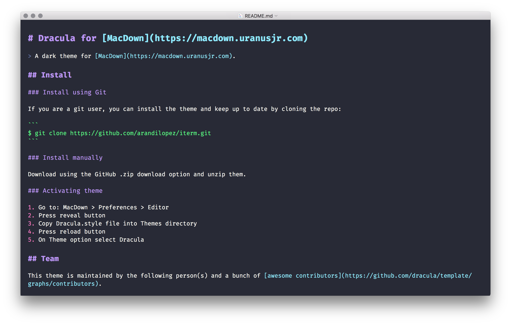

# Dracula for [MacDown](https://macdown.uranusjr.com)

> A dark theme for [MacDown](https://macdown.uranusjr.com).



## Install

### Install using Git

If you are a git user, you can install the theme and keep up to date by cloning the repo:

```
$ git clone https://github.com/dracula/macdown.git
```

### Install manually

Download using the GitHub .zip download option and unzip them.

### Activating theme

1. Go to: MacDown > Preferences > Editor
2. Press reveal button
3. Copy Dracula.style file into Themes directory
4. Press reload button
5. On Theme option select Dracula

## Team

This theme is maintained by the following person(s) and a bunch of [awesome contributors](https://github.com/dracula/template/graphs/contributors).

[](https://github.com/JimmyMultani) |
--- |
[Arandi López](https://github.com/arandilopez) |

## License

[MIT License](./LICENSE)
